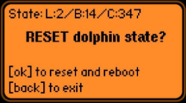

## fz_dope

Simple Flipper Zero app for resetting [dolphin](https://docs.flipperzero.one/basics/dolphin) state - just removes /int/.dolphin.state file and reboots.

App name is a reference to the substances, making [Jones](https://williamgibson.fandom.com/wiki/Jones) happy again:
> Jones heaved to the surface for Molly to stab him with the Syrette. Propellant gas hissed, patterns of light sparked and then faded to black. He ended up drifting and rolling languorously in the dark water when they left.

Current state is displayed on a first line in a form of "State: L:level/B:butthurt/C:icounter", see [here](https://github.com/flipperdevices/flipperzero-firmware/blob/dev/applications/services/dolphin/dolphin.h).

[Build](https://flipc.org/u0d7i/fz_dope) on https://flipc.org

### Rationale

Some reddit user on /r/flipperzero: "I'm going to have to cancel my order, I don't think I can deal with something with eyes that sad." [here](https://www.reddit.com/r/flipperzero/comments/u9g79f/my_flipper_is_always_depressed_how_can_i_fix_this/)

### P.S.
[Petting a dolphin](https://github.com/EugeneSmile/PetADolphin) may be a better approach (fap is available [here](https://flipc.org/EugeneSmile/PetADolphin)).
