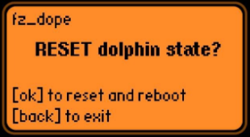

## fz_dope

Simple Flipper Zero app for resetting [dolphin](https://docs.flipperzero.one/basics/dolphin) state - just removes /int/.dolphin.state file and reboots.

App name is a reference to the substances, making [Jones](https://williamgibson.fandom.com/wiki/Jones) happy again.

Current state is displayed on a first line in a form of "State: L:level/B:butthurt/C:icounter", see [here](https://github.com/flipperdevices/flipperzero-firmware/blob/dev/applications/services/dolphin/dolphin.h).

### Rationale

Some reddit user on /r/flipperzero: "I'm going to have to cancel my order, I don't think I can deal with something with eyes that sad."
